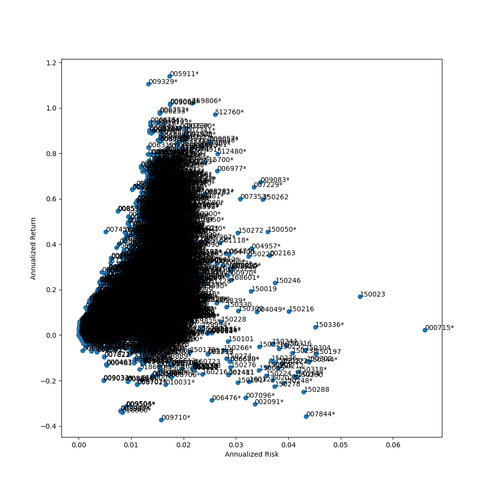
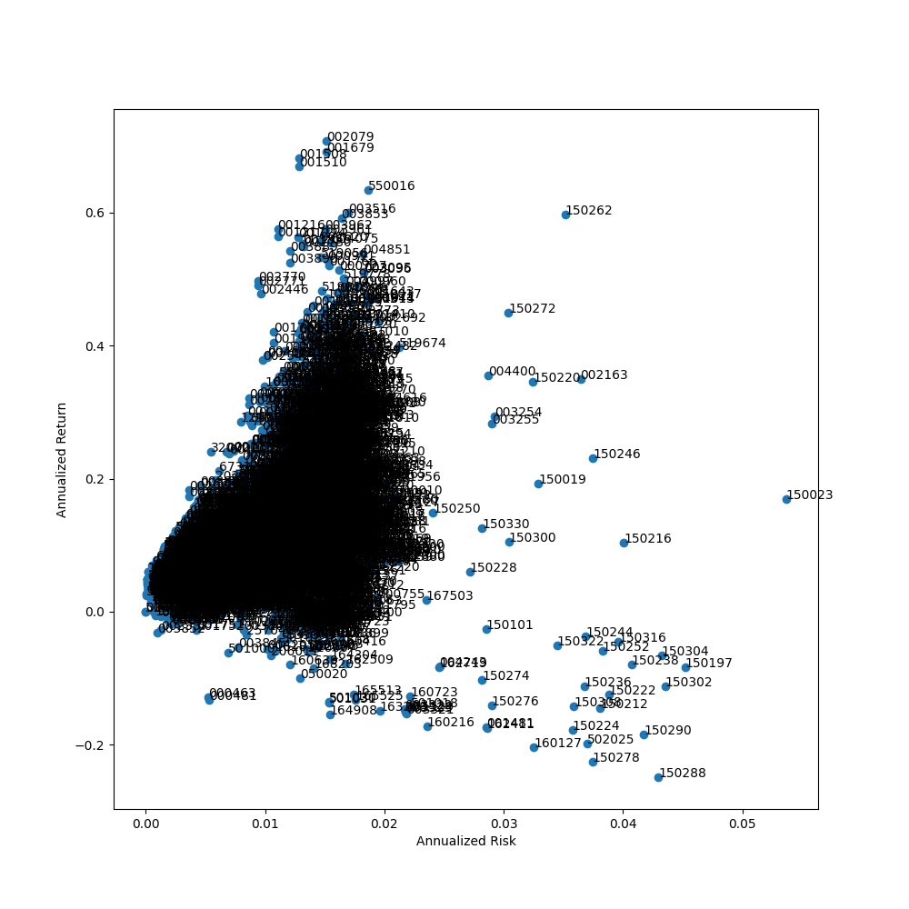
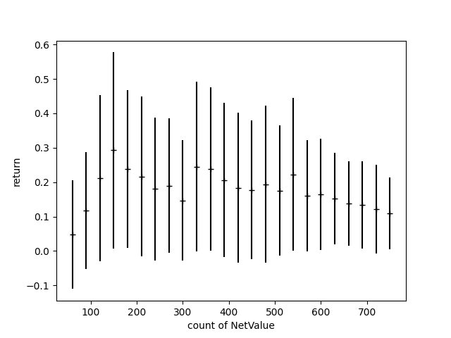

# analyzeChineseFund
The fund is the portfolio of stocks and other assets, we can analyze the relation of two funds by cossine of stock array.

```
git clone https://github.com/wangershi/analyzeChineseFund.git
```

## compare all funds in same time range is not a easy job
I want to get the return and risk in 3 years for all funds.

You can get it by following commands.
```
python analyzeFundData.py analyzeHistoricalValue
```

The return is annualized and the risk is the variance of return in every day.
So I get the return and risk for all funds as below.
The last day I analyze is Dec 2nd, 2020, some results are based on this day.



The funds with * don't last 3 years, because the stock market rally in 2020, so many funds founding in 2020 outperforms old funds, the annualized return of fund 005911 reach up to ~115%, it's amazing!!!
Actually, the fund 005911 is founded in Nov 2018, so the value won't be influenced by stock market crash in 2018.
So when we exclude those funds less than 3 years, the maximum annualized return is ~70%.



But it's not smart to exclude those funds simply, in those days I will find a way to adjust the return and risk of those funds so we can compare all funds in same range.

## quantitively analyze
In this section, I will analyze the average and standard deviation of return, risk, return/risk for funds in same founding days.
For example, since fund "007994" founded in Mar 25th, 2020, the founding days without non-trading days is 167, I will divide it by 30 and append it it bucket "150" (167//30\*30), and repeat this for all funds.
```
python analyzeFundData.py getAverageSlopeForFundsInSameRange
```
We can get the average of annualized return.



It's easy to find some interesting points in this chart, the average return is not same in different days, and the highest is the funds founding in ~150 days, almost the day after pandamic in China (Although it seems the pandemic won't disappear in 2021, but the market think China recoverd from pandemic in March 2020 and it had been controlled), in that time the market recovered from the pandemic and almost every fund earns a lot after that.

But this will bother us when we want to choose some funds when we want to buy, if the choosen are only based on annualized return, it's unfair for some old funds and this give us a wrong direction to choose funds. In my perspective, I want to buy some old funds, such as fund "110011":), the reason is I'm a risk averter and I prefer to choose the funds less influenced by big stock market crash, e.g. the crash in 2018.

So in next section I will find a way to elimate the influence of foundation date and flatten the average return.

## flatten average return
As the purpose is to compare all funds in same time range, it's a good way to estimate the return in 3 years for those funds founding less than 3 years.

So the question is, how can we estimate?

For a fund, we count the net value by count its portfolio (deposit, bond and some stocks). But there are two difficulties to get the porfolio in all days.
 - The fund managers publish the statements regularly, e.g., three months. We can't get the fortfolio between the publishing date
 - The fortfolio in the publishing date is different with the fortfolio in statements, but we don't konw the exact date

So it's hard to use the portfolio in all statements, and to simple our model, we assume the portfolio keep unchanged.

It may be easier to get the historical price of all elements in portfolio, but there are another question, the portfolio is not a full list (Refer to a [Chinese blog](https://zhuanlan.zhihu.com/p/314235923) I wrote). In some funds, about 10% assets is unkonwn, so it's a question how we count it.

As there are a lot difficulties to estimate the value by count the historical price of all elements in portfolio, I want to solve this by another perspective. The hypothesis is all managers tend to use same strategies to manage the fund, for example, for example, if the portfolio of two funds by different managers are related to clean energy, they tend to buy same stocks in almost same ratio, so I can estimate the newer fund by older fund.

I analyze the covariance matrix for all funds and try to find the maximum covariance for each fund, it seems all the maximum covariance is near 1, so we can find a similar fund for every fund.
