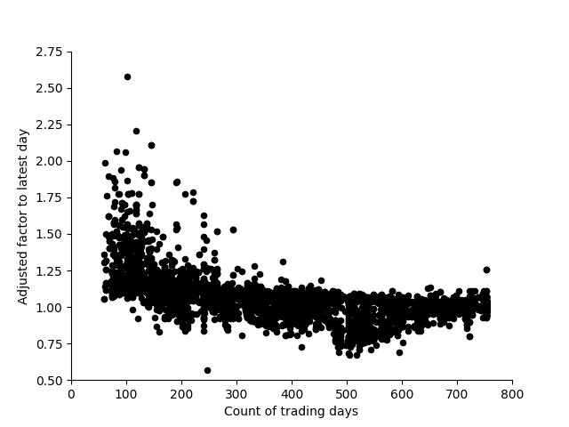

# analyzeChineseFund

## about this project
This project is a homework when I study in the AI School 2020, Microsoft, you can find the paper in [Method to Compare Two Funds Issued Before and After Stock Crash](doc/main.pdf), the idea is to elimate the influence by the fluctuation in overall stock market, for example, funds issued in May 2020 gain a lot just because the bull market, it troubles us when we compare it to some old issues. 


## clone this project
```
git clone https://github.com/wangershi/analyzeChineseFund.git
```

## install related packages
You should run the scripts in Python3 and install below packages.
```
pip install -r .\requirements.txt
```

## data prepare

Use below commands to crawl the data.
```
python src/crawlFundData.py crawlAllFundData --ifCrawlBasicInformation=True --ifCrawlPortfolio=True --ifCrawlHistoricalValue=True
```

Prepare data to train.
```
python src/trainGBDT.py prepareTrainDataset
```

To find more details, please refer to [dataPrepare](doc/dataPrepare.md).

## use GBDT to imitate the older fund
### training
You can train the model and evaluate it like this.
```
python src/train/trainGBDT.py trainModel
```
### evaluate
Get the adjusted factor to latest day.
```
python src/train/trainGBDT.py testModel --ifLoadDatasetFromFile=True
```

We get the adjustFactorToLatestDay to dayInStandard.


I try to use optuna to fine tune automatically, but the result is not good, so I quit it.
```
python src/train/trainGBDT.py autoFineTune
```

After we get the adjusted factor, we can evaluate it again.
```
python src/analyzeData.py getAverageSlopeForFundsInSameRange --ifUseAdjustFactorToLatestDay=True
```

The model flatten the distribution of average return.


The standard deviation of average return drop from 0.0520 to 0.0175.

Besides, we can get the  return and risk after adjusted.
```
python src/analyzeData.py analyzeHistoricalValue --ifUseNewIssues=True --ifUseOldIssues=True --ifUseWatchList=False --ifUseAdjustFactorToLatestDay=True --ifPrintFundCode=False
```

