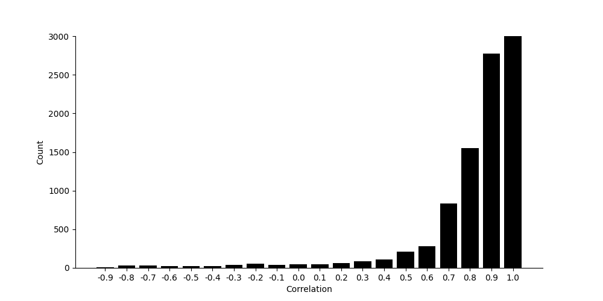

# analyzeChineseFund
The fund is the portfolio of stocks and other assets, we can analyze the relation of two funds by cossine of stock array.

```
git clone https://github.com/wangershi/analyzeChineseFund.git
```

## compare all funds in same time range is not a easy job
I want to get the return and risk in 3 years for all funds.

You can get it by following commands.
```
python analyzeFundData.py analyzeHistoricalValue
```

The return is annualized and the risk is the variance of return in every day.
So I get the return and risk for all funds as below.
The last day I analyze is Dec 2nd, 2020, some results are based on this day.


The funds with * don't last 3 years, because the stock market rally in 2020, so many funds founding in 2020 outperforms old funds, the annualized return of fund 005911 reach up to ~115%, it's amazing!!!
Actually, the fund 005911 is founded in Nov 2018, so the value won't be influenced by stock market crash in 2018.
So when we exclude those funds less than 3 years, the maximum annualized return is ~70%.


But it's not smart to exclude those funds simply, in those days I will find a way to adjust the return and risk of those funds so we can compare all funds in same range.

## quantitively analyze
In this section, I will analyze the average and standard deviation of return, risk, return/risk for funds in same founding days.
For example, since fund "007994" founded in Mar 25th, 2020, the founding days without non-trading days is 167, I will divide it by 30 and append it it bucket "150" (167//30\*30), and repeat this for all funds.
```
python analyzeFundData.py getAverageSlopeForFundsInSameRange
```
We can get the average of annualized return.


It's easy to find some interesting points in this chart, the average return is not same in different days, and the highest is the funds founding in ~150 days, almost the day after pandamic in China (Although it seems the pandemic won't disappear in 2021, but the market think China recoverd from pandemic in March 2020 and it had been controlled), in that time the market recovered from the pandemic and almost every fund earns a lot after that.

But this will bother us when we want to choose some funds when we want to buy, if the choosen are only based on annualized return, it's unfair for some old funds and this give us a wrong direction to choose funds. In my perspective, I want to buy some old funds, such as fund "110011":), the reason is I'm a risk averter and I prefer to choose the funds less influenced by big stock market crash, e.g. the crash in 2018.

So in next section I will find a way to elimate the influence of foundation date and flatten the average return.

## how to flatten average return
As the purpose is to compare all funds in same time range, it's a good way to estimate the return in 3 years for those funds founding less than 3 years.

So the question is, how can we estimate?

### can we count the net value by count its portfolio?
For a fund, we count the net value by count its portfolio (deposit, bond and some stocks). But there are two difficulties to get the porfolio in all days.
 - The fund managers publish the statements regularly, e.g., three months. We can't get the fortfolio between the publishing date
 - The fortfolio in the publishing date is different with the fortfolio in statements, but we don't konw the exact date

So it's hard to use the portfolio in all statements, and to simple our model, we assume the portfolio keep unchanged.

It may be easier to get the historical price of all elements in portfolio, but there are another question, the portfolio is not a full list (Refer to a [Chinese blog](https://zhuanlan.zhihu.com/p/314235923) I wrote). In some funds, about 10% equities is unkonwn, so it's a question how we count it.

### fund managers tend to use similar strategy
As there are a lot difficulties to estimate the value by count the historical price of all elements in portfolio, I want to solve this by another perspective. The hypothesis is that the investing strategies is limited and we can find the strategies using by another manager is same or similar to any strategy.

This can be verified by the correlation of two funds' net value. For example we can use Pearson's correlation method to get the correlation between fund '110011' and other funds.
```
python analyzeFundData.py getCorrelationMatrixForOneFund
```



For Pearson's correlation, "1" represents these two funds are fully correlated, "-1" represents these two funds are totally negative correlated, "0" represents these two funds are totally uncorrelated.

So, little funds are negative correlated with fund '110011', and the funds are mainly correlated with this fund, partically, some numbers of correlation are 1.0 so some funds are fully correlated with fund '110011'.

This is consistent with our qualitative analysis. For example, if the portfolio of two funds by different managers are related to clean energy, they tend to buy same stocks in almost same ratio.

### confirm it in all funds
To confirm it, I analyze the Pearsom's correlation matrix for all funds and try to find the maximum correlation for each fund, it seems all the maximum correlation is near 1, so we can find a similar fund for every fund.
```
python analyzeFundData.py getCorrelationMatrixForAllFunds
```


Based on analysis above, another way to estimate the return in 3 years is we can let newer fund imitate the return of the older fund with same portfolio. But we can't find two funds with same portfolio, so we should train a model to elimate the influence of different portfolio and unknown equities.

## use GBDT to imitate the older fund
I use [LightGBM](https://github.com/microsoft/LightGBM) to train GBDT, and I suggest to use Anaconda to install this repository in Ubuntu, it's useful.
```linux
conda create --name python36 python=3.6
source activate python36
conda install lightgbm
```

### Data prepare
#### portfolio
We use portfolio as one part of input, so we need to change it into a one-shot vector, and we need get the set of elements in portfolio of all funds.
```
python prepareDataset.py getAllElementsInPortfolio
```
There are 3 parts.
 - assetsAllocation. Include bondPortion, cashPortion, stockPortion.
 - bond. Include 6715 bonds.
 - stock. Include 2855 stocks.

So we can get a sparse matrix for portfolio of all funds, each coloumn represent a fund and the head record the fund code. Besides, there are 9573 columns representing the set of elements in portfolio.
```
python prepareDataset.py getSparseMatrixForPortfolioInAllFunds
```

#### historical value
Because we need to estimate the return in 3 years for those funds founding less than 3 years, so we can only use the funds founding more than 3 years as the training and test sets.

But which day can we pick to estimate the return in 3 years? 2 years or 1 years? This is a question, we can't fix the virtual founding day, one reason is the funds we estimate have multi founding days, and it's ridiculous for us to find a lucky day we assign to do this job.

So I will choose multi days to estimate it, for example, I will use the return in 2 years to estimate the return in 3 years, also, I will use the return in 1 years to estimate the return in 3 years, this means the input includes virtual founding day.

There are another question, which day we use to estimate the return for those funds founding less than 3 years?

Use the last day? I don't think so. As the stock market are chaotic, we don't know why the stocks rise or go down in one day, so do funds. So I prefer to use lots of virtual founding days to estimate the return in 3 years.

But actually, the near two days the estimation is clearer, so I will add weights for those predicted results and I want the model to get the weights automatically.

## Cosine between portfolio of two funds
As we can get sparse matrix for portfolio of all funds, we can use cosine between two vectors in this matrix to represent the correlation of two funds.
```
python analyzePortfolio.py getCosineOfSparseMatrixForPortfolio
```

We can analyze one fund.
```
python analyzePortfolio.py analyzeCosineForOneFund
```


It seems most of the values are located around 0 or 1.

We can regard cosine as some forms of correlation, where cosine=1 means those two funds are related. But this image is different with the correlation image in [fund managers tend to use similar strategy](### fund managers tend to use similar strategy), where the last image have few correlation locating around 0. To confirm this, I print it in the image, coordinate x represents cosine, coordinate y represents Pearson's correlation.


